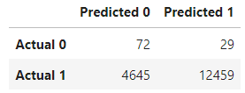
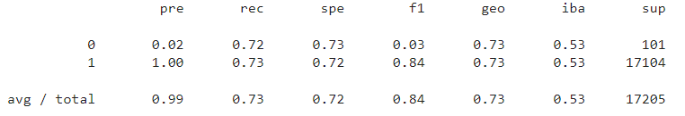

# Credit_Risk_Analysis
## Overview of Analysis
In this analysis, credit data from more than 68,000 loan applicants was analyzed to determine the best Python machine learning model that predicts whether an individual is a high credit risk or low credit risk using the various data preprocessing methods and machine learning algorithms below:
* Oversampling with **imbalanced-learn**'s RandomOverSampler algorithm and performing a logistic regression with **scikit-learn**.
* Oversampling with **imbalanced-learn**'s SMOTE algorithm and performing a logistic regression with **scikit-learn**.
* Undersampling using **imbalanced-learn**'s ClusterCentroid algorithm and performing a logistic regression with **scikit-learn**.
* Using a combinatorial approach of over- and undersampling using **imbalanced-learn**'s SMOTEENN algorithm and performing a logistic regression with **scikit-learn**.
* Two machine learning models that reduce bias were also employed: **imbalanced-learn**'s BalancedRandomForestClassifier and EasyEnsembleClassifier.
## Results
Each of the machine learning models implemented had their predictions assessed for accuracy, predictive value (pre), recall (rec), and F1-score (f1) (amongst other statistical assessments). A confusion matrix was also created to assess each model. A prediction of 0 represents high credit risk, and a prediction of 1 represents a low credit risk. 
**1)** Oversampling with **imbalanced-learn**'s RandomOverSampler and  logistic regression with **scikit-learn**: 

* Accuracy of model: 

     

* Confusion Matrix:  

     

* Predictive value (pre), recall (rec), and F1-score (f1): 

     

**2)** Oversampling with **imbalanced-learn**'s SMOTE algorithm and logistic regression with **scikit-learn**: 

* Accuracy of model: 

     

* Confusion Matrix:  

     

* Predictive value (pre), recall (rec), and F1-score (f1): 

     

**3)** Undersampling using **imbalanced-learn**'s ClusterCentroid algorithm and logistic regression with **scikit-learn**:

* Accuracy of model: 

     

* Confusion Matrix:  

     

* Predictive value (pre), recall (rec), and F1-score (f1): 

     

**4)** Combinatorial approach of over- and undersampling using **imbalanced-learn**'s SMOTEENN algorithm and logistic regression with **scikit-learn**:

* Accuracy of model: 

     

* Confusion Matrix:  

     

* Predictive value (pre), recall (rec), and F1-score (f1): 

     

**5)** **imbalanced-learn**'s BalancedRandomForestClassifier:

* Accuracy of model: 

     

* Confusion Matrix:  

     

* Predictive value (pre), recall (rec), and F1-score (f1): 

     

* Most important data features for model: 

     

**6)** **imbalanced-learn**'s EasyEnsembleClassifier:

* Accuracy of model: 

     

* Confusion Matrix:  

     

* Predictive value (pre), recall (rec), and F1-score (f1): 

     

## Summary
The algorithm that created prediction values that most closely resembled the target vector testing data was the imbalanced-learn's EasyEnsembleClassifier with an accuracy of 92.8%. The EasyEnsembleClassifier is an ensemble of AdaBoost learners trained on different balanced boostrap samples. The balancing is achieved by random under-sampling. 

Adaboost (or adaptive boosting) is an algorithm that combines weak learners like RandomForest does. It trains one model, evaluates errors of that model, then trains another successive model that adds more weight to those errors. The purpose of this weighting is to minimize similar errors in subsequent models. The errors from the second model are given extra weight for the third model. This process is repeated until the error rate is minimized. EasyEnsembleClassifier is an ensemble of these Adaboost learners. 

The algorithm that showed the lowest accuracy was the imbalanced-learn's ClusterCentroid algorithm and logistic regression with scikit-learn with an accuracy of 70.0%. 

The following is a list of ML algorithms by accuracy: 

1) imbalanced-learn's EasyEnsembleClassifier: **92.8%**
2) imbalanced-learn's BalancedRandomForestClassifier: **74.0%**
3) Oversampling with imbalanced-learn's SMOTE algorithm and     logistic regression with scikit-learn: **72.5%**
4) Oversampling with imbalanced-learn's RandomOverSampler and logistic regression with scikit-learn: **72.1%**
5) Combinatorial approach of over- and undersampling using imbalanced-learn's SMOTEENN algorithm and logistic regression with scikit-learn: **71.6%**
6) imbalanced-learn's ClusterCentroid algorithm and logistic regression with scikit-learn: **70.0%** 

All of the ML algorithms showed a predictive value (average) for deciding whether an individual is a high or low credit risk of about 0.99/1.00, however this value is vastly attributed to the predictive value of a low-risk individual, and the predictive value for high risk individuals tended to be quite low for all algorithms. 

The following list is the average recall performance for all ML algorithms (**out of 1.00**): 
1) imbalanced-learn's EasyEnsembleClassifier: **0.94**
2) imbalanced-learn's BalancedRandomForestClassifier: **0.85**
3) Oversampling with imbalanced-learn's SMOTE algorithm and     logistic regression with scikit-learn: **0.73**
4) Oversampling with imbalanced-learn's RandomOverSampler and logistic regression with scikit-learn: **0.73**
5) Combinatorial approach of over- and undersampling using imbalanced-learn's SMOTEENN algorithm and logistic regression with scikit-learn: **0.71**
6) imbalanced-learn's ClusterCentroid algorithm and logistic regression with scikit-learn: **0.66** 

The F1-scores showed a similar trend with the EasyEnsembleClassifier algorithm having the highest and the ClusteredCentroids having the lowest.  

With these results, the best model to implement in determining credit risk of loan applicants is imbalanced-learn's EasyEnsembleClassifier.